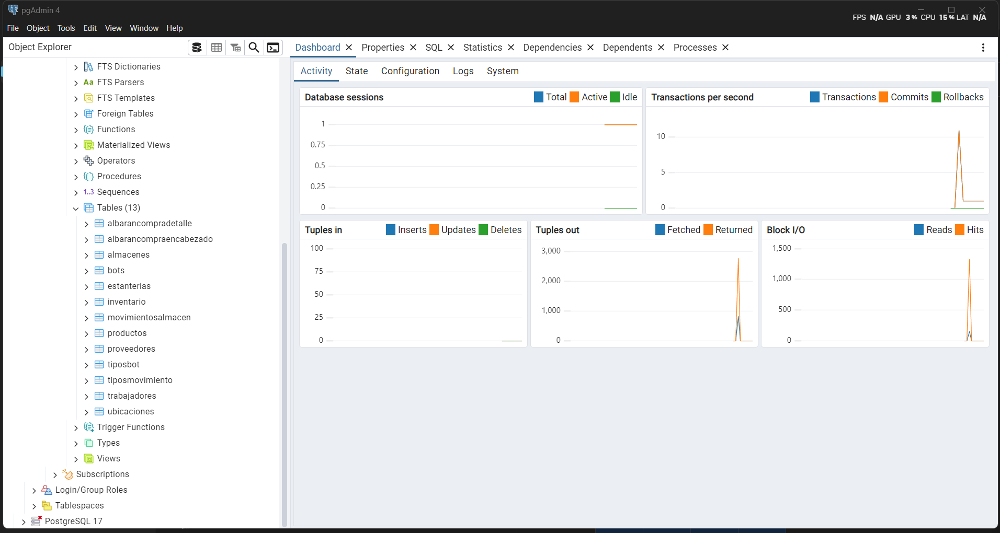

# SI-GEFAL: Simulación Integral de un Almacén Autónomo 🤖🏭🚀

Bienvenido al repositorio de la base de datos para el proyecto **SI-GEFAL**. Este no es solo un conjunto de tablas, sino la **columna vertebral de datos** que da vida a una plataforma completa para la simulación y gestión de un almacén totalmente autónomo.

---

## 🌟 Visión del Proyecto

El proyecto **SI-GEFAL** (Simulación Integral de un Almacén Autónomo) nace con el objetivo de crear un ecosistema digital para modelar, operar y optimizar la logística de la Industria 4.0. La base de datos, construida sobre **PostgreSQL**, es el primer y más crucial componente, diseñado para:

*   **Modelar la Realidad:** Representar con precisión todos los elementos de un almacén moderno: productos, estanterías, ubicaciones dinámicas, robots de transporte (AGVs), operarios y flujos de pedidos.
*   **Ser el Corazón de las Operaciones:** Almacenar cada transacción, movimiento de inventario y estado del sistema en tiempo real.
*   **Habilitar la Inteligencia:** Servir como fuente de datos fiable para módulos futuros de análisis, machine learning y optimización de rutas o asignación de tareas.
*   **Proporcionar una Base Sólida:** Ser el backend para aplicaciones de gestión (dashboards), APIs y la interfaz de control de los agentes autónomos.

---

## 🚧 Estado Actual y Próximos Pasos

Este proyecto es un sistema modular que se está construyendo por fases.

*   **✅ Fase 1: El Núcleo de Datos (¡Completada!)**
    *   El diseño, creación y populación de la base de datos relacional en PostgreSQL está finalizado y es completamente funcional. Este repositorio contiene todo lo necesario para desplegarla.

*   **🛠️ Fase 2: Lógica de Negocio y API (En Desarrollo)**
    *   Actualmente se está trabajando en una API REST que expondrá los datos y permitirá la interacción segura con el almacén.

*   **🚀 Fases Futuras: Simulación y Visualización**
    *   Desarrollo de un dashboard de visualización para monitorizar el almacén en tiempo real.
    *   Creación de un motor de simulación para probar escenarios de estrés y eficiencia.
    *   Integración con agentes autónomos (simulados o físicos).

---

## ✨ Vista Previa del Sistema

Estas imágenes muestran la estructura de datos que hemos construido, la cual ya está lista para soportar las operaciones del almacén.

#### Estructura Inicial de Tablas


#### Simulación de Datos y Operaciones



---

## 🚀 Puesta en Marcha (Setup del Núcleo de Datos)

Para replicar la base de datos del proyecto en tu entorno local, sigue estos pasos:

### Prerrequisitos
*   **PostgreSQL** instalado y en ejecución.
*   Una herramienta cliente como **pgAdmin**, **DBeaver** o `psql`.

### Pasos de Instalación
1.  **Clona el repositorio:**
    ```bash
    git clone https://github.com/rafaelsotove73/PosgretBaseData_Alm_WareHouse.git
    cd PosgretBaseData_Alm_WareHouse
    ```

2.  **Crea la Base de Datos:**
    Conéctate a PostgreSQL y crea una base de datos para el proyecto.
    ```sql
    CREATE DATABASE sigefal_db;
    ```

3.  **Ejecuta el Script de Creación:**
    Usa tu herramienta preferida para conectarte a `sigefal_db` y ejecuta el contenido completo del archivo `CreateBasesdatosTablesAll.sql`. Esto creará todas las tablas, relaciones y cargará los datos de simulación iniciales.

¡Listo! La base del proyecto **SI-GEFAL** está ahora activa en tu sistema.

---

## 📁 Estructura de Archivos
Use code with caution.
Markdown
.
├── PostgreSQLSimulacionAlmacen/ # Carpeta con imágenes de la simulación
│ ├── Inicio.png # Vista general de las tablas
│ ├── Next01.png # Detalle de datos 1
│ └── Next02.png # Detalle de datos 2
│
├── CreateBasesdatosTablesAll.sql # Script SQL maestro para crear y poblar la BD
│
└── README.md # Este archivo de documentación
---

## 🔧 Tecnologías Utilizadas

*   **Base de Datos:** PostgreSQL
*   **Lenguaje de Scripting:** PL/pgSQL

---
Creado por **[rafaelsotove73](https://github.com/rafaelsotove73)**
